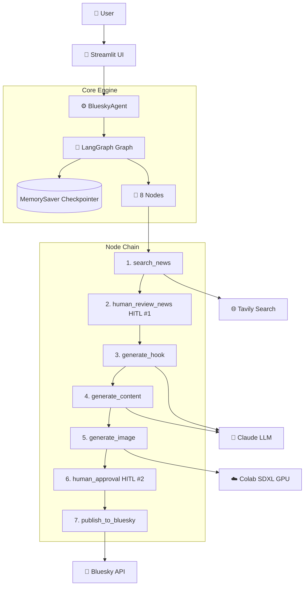

# 🦋 Bluesky Image Post Agent

A production-ready LangGraph agent that searches for the latest news on any topic, generates a professional Bluesky post and an AI image using Stable Diffusion XL, reviews everything with you through a Streamlit UI, and posts it directly to your Bluesky account.

---

## 📋 Table of Contents

- [Overview](#-overview)
- [Features](#-features)
- [Architecture](#-architecture)
- [Tech Stack](#-tech-stack)
- [Installation](#-installation)
- [Usage](#-usage)
- [Project Structure](#-project-structure)
- [Security & Privacy](#-security--privacy)

---

## 🎯 Overview

Bluesky Image Post Agent is an AI-powered social media automation tool that combines news intelligence with AI image generation. It leverages:

- 📰 **Real-Time News Search** via Tavily to find the latest articles on any topic.
- 🎨 **AI Image Generation** via Stable Diffusion XL running on a free Google Colab T4 GPU.
- 🛡️ **Human-in-the-Loop (HITL)** — two approval checkpoints before anything goes live.
- 🦋 **Bluesky Publishing** via the official atproto Python SDK.
- ⚡ **Streamlit UI** for reviewing the generated image and post side by side.

Built for creators, developers, and researchers who want to automate high-quality, news-grounded social media posts with full control over what gets published.

---

## 🎥 What Makes This Special?

| Feature | Description |
|---|---|
| 📰 **News Grounded** | Every hook, post, and image prompt is based strictly on real news articles — no hallucinated facts. |
| 🎨 **AI Image Generation** | SDXL generates a photorealistic 900x900 image that visually represents the post's core message. |
| 🛡️ **Two HITL Checkpoints** | You approve the news articles first, then the post + image before it ever goes live. |
| 👀 **See the Image Before Posting** | The Streamlit UI shows the generated image directly — no "open it yourself" guesswork. |
| ✏️ **Edit and Regenerate** | Provide edit instructions and both the post and image regenerate automatically. |
| 🔒 **Zero Data Leaks** | Strict `.gitignore` policy — no keys, no images, no databases ever reach GitHub. |

---

## ✨ Features

### 📰 News Intelligence

- **Topic Search:** Fetch up to 8 recent articles on any topic via Tavily advanced search.
- **Article Selection:** You hand-pick which articles to use before content generation starts.
- **Retry Loop:** Reject all articles and trigger a fresh search up to 3 times.

### 🎨 AI Content Generation

- **Hook Generation:** Claude generates 3 hook options and scores each one on Specificity, Relevance, Credibility, and Scroll-stop. Best score wins.
- **Post Writing:** Claude writes a 100-250 word professional Bluesky post grounded entirely in the selected news articles.
- **Image Prompt:** Claude writes a detailed SDXL prompt — scene, lighting, camera details, ending with `photorealistic, cinematic, 8k`.
- **Image Generation:** Stable Diffusion XL on a free Colab T4 GPU generates a 900x900 photorealistic image.

### 🛡️ Safety & Control

- **HITL #1 — News Review:** Graph pauses after fetching articles. You tick the ones you want.
- **HITL #2 — Final Approval:** Graph pauses after image generation. You see the image and post side by side before deciding to Approve, Edit, or Reject.
- **Edit Path:** Provide instructions, both post and image regenerate with those changes applied.
- **Error Handler:** Any failure at any node is caught gracefully — logged and surfaced in the UI without crashing.

### 💬 Streamlit UI

- **Side-by-Side Review:** Generated image on the left, post text on the right.
- **Character Count Metric:** Live counter showing chars used vs Bluesky's 300 limit.
- **Image Prompt Expander:** Transparency panel showing the exact SDXL prompt used.
- **Activity Log:** Sidebar shows the last 10 actions taken in the current run.
- **Environment Status:** Sidebar shows green/red indicators for all 5 required API keys.
- **One-Click Post Link:** After publishing, a button opens the live Bluesky post directly.

---

## 🏗️ Architecture



**Core Components:**

- **BlueskyAgent:** Wraps the LangGraph graph and exposes a clean `start()` / `resume()` API.
- **MemorySaver:** Keeps the full graph state in memory across HITL pauses so no progress is lost.
- **interrupt() + Command:** LangGraph's HITL pattern — nodes pause themselves and wait for a `Command(resume=...)` before continuing.
- **Gradio Bridge:** Your local machine talks to SDXL running on Colab's free GPU via a public Gradio URL.

---

## 🛠️ Tech Stack

| Component | Technology |
|---|---|
| Language | Python 3.9+ |
| Agent Framework | LangGraph |
| LLM | Groq llama-3.1-8b-instant via LangChain Groq |
| News Search | Tavily via langchain-tavily |
| Image Generation | Stable Diffusion XL on Google Colab T4 GPU |
| Image Server | Gradio (running on Colab, public URL) |
| Bluesky SDK | atproto |
| UI Framework | Streamlit |
| Image Processing | Pillow |
| Package Manager | uv (recommended) |

---

## 📦 Installation

### Prerequisites

- Python 3.9 or higher
- A Google account (for free Colab GPU)
- A Bluesky account (free at [bsky.app](https://bsky.app))
- API keys for Anthropic and Tavily (both have free tiers)

### Step 1: Clone the Repository

```bash
git clone https://github.com/yourusername/Agentic-Ai-LangGraph-Agent.git
cd bluesky-agent
```

### Step 2: Install Dependencies

Using `uv` (recommended):

```bash
uv venv
source .venv/bin/activate      # Windows: .venv\Scripts\activate
uv add -r requirements.txt
```

Or with pip:

```bash
pip install -r requirements.txt
```

### Step 3: Set Up Google Colab for Image Generation

Open [Google Colab](https://colab.research.google.com) and create a new notebook.

Set the runtime to **T4 GPU**: `Runtime → Change runtime type → T4 GPU`

Paste and run this cell:

```python
from diffusers import DiffusionPipeline
import torch

pipe = DiffusionPipeline.from_pretrained(
    "stabilityai/stable-diffusion-xl-base-1.0",
    torch_dtype=torch.float16,
    use_safetensors=True,
    variant="fp16"
)
pipe.to("cuda")

negative_prompt = (
    "cartoon, painting, illustration, blurry, deformed, ugly, "
    "low quality, CGI, toy, fake, animated, artificial background"
)

def generate_image(prompt, negative_prompt, steps=50, guidance=7.5):
    image = pipe(
        prompt,
        negative_prompt=negative_prompt,
        height=1024,
        width=1024,
        num_inference_steps=int(steps),
        guidance_scale=float(guidance)
    ).images[0]
    return image

import gradio as gr

demo = gr.Interface(
    fn=generate_image,
    inputs=[
        gr.Textbox(label="Prompt"),
        gr.Textbox(label="Negative Prompt", value=negative_prompt),
        gr.Slider(20, 100, value=50, step=1,    label="Steps"),
        gr.Slider(1,  20,  value=7.5, step=0.5, label="Guidance Scale"),
    ],
    outputs=gr.Image(label="Generated Image"),
)
demo.launch(share=True)
```

After it runs, Colab prints:

```
Running on public URL: https://abc123def456.gradio.live
```

Copy that URL. **It changes every time you restart the Colab notebook.**

### Step 4: Set Up Environment Variables

```bash
cp .env.example .env
```

Edit `.env`:

```env
# Claude LLM - get it from console.anthropic.com
GROQ_API_KEY=your_groq_api_key

# Tavily news search - get it from app.tavily.com
TAVILY_API_KEY=your_tavily_api_key

# Google Colab Gradio URL - copy from Colab output after running the notebook
# Updates every time you restart Colab
GRADIO_URL=https://xxxx.gradio.live

# Your Bluesky username e.g. yourname.bsky.social
BLUESKY_HANDLE=yourname.bsky.social

# Bluesky app password - Settings -> Privacy and Security -> App Passwords
# Do NOT use your main account password
BLUESKY_APP_PASSWORD=xxxx-xxxx-xxxx-xxxx
```

**Getting your Bluesky App Password:**
1. Go to [bsky.app](https://bsky.app) and log in
2. Click your profile picture → **Settings**
3. Click **Privacy and Security**
4. Scroll to **App Passwords** → click **Add App Password**
5. Give it a name (e.g. `post-agent`) and click **Create App Password**
6. Copy the password — it is only shown once

### Step 5: Test Your Bluesky Tokens

```bash
python test_bluesky_tokens.py
```

Expected output:
```
Testing tokens...
Handle: yourname.bsky.social
Logged in as: Your Name
Posted successfully
Post URL: https://bsky.app/profile/yourname.bsky.social/post/xxxxx
Tokens are working correctly. You can delete that test post from your profile.
```

---

## 🚀 Usage

### Streamlit UI (recommended)

```bash
streamlit run app.py
```

Open your browser at `http://localhost:8501`.

### CLI

```bash
python main.py --topic "AI Agents 2026"
```

With audience:

```bash
python main.py --topic "AI Agents 2026" --audience "AI developers and startup founders"
```

### Interaction Flow

1. **Enter Topic** — type what you want to post about
2. **Review Articles** — tick the news articles you want, click Approve
3. **Wait for Generation** — hook, post, and image generate automatically (~60 seconds)
4. **Review Post + Image** — see image and post side by side. Approve, Edit, or Reject
5. **Published** — click the link to open your live Bluesky post

---

## 📁 Project Structure

```
bluesky-agent/
│
├── .gitignore
├── .env.example
├── app.py                      # Streamlit UI
├── main.py                     # BlueskyAgent class + CLI entry point
├── test_bluesky_tokens.py      # Quick token verification script
├── requirements.txt
├── README.md
│
├── config/                     # Configuration
│   ├── __init__.py
│   └── settings.py             # All config dataclasses and constants
│
├── core/                       # Shared State
│   ├── __init__.py
│   └── state.py                # BlueskyAgentState TypedDict
│
├── edges/                      # Graph Routing
│   ├── __init__.py
│   └── routing.py              # Conditional routing functions
│
├── nodes/                      # Agent Nodes (8 total)
│   ├── __init__.py
│   ├── search_news.py          # Node 1: Tavily news search
│   ├── human_review_news.py    # Node 2: HITL #1 — article selection
│   ├── generate_hook.py        # Node 3: Claude hook generation + scoring
│   ├── generate_content.py     # Node 4: Claude post + image prompt
│   ├── generate_image.py       # Node 5: SDXL image via Colab Gradio
│   ├── human_approval.py       # Node 6: HITL #2 — final review
│   ├── publish_to_bluesky.py   # Node 7: Bluesky publishing via atproto
│   └── error_handler.py        # Node 8: Graceful failure logging
│
├── tools/                      # External Service Wrappers
│   ├── __init__.py
│   ├── search_tools.py         # Tavily wrapper
│   ├── image_generator.py      # Gradio/SDXL wrapper
│   └── bluesky_tools.py        # atproto SDK wrapper
│
└── data/                       # Generated images (git ignored)
    └── .gitkeep
```

---

## 🔒 Security & Privacy

This project is designed with a **"Local-First"** data philosophy:

- **No Key Leaks:** `.env` is strictly blocked by `.gitignore`. Your API keys never reach GitHub.
- **No Image Leaks:** `data/*` is ignored — generated images stay on your machine only.
- **Secret Protection:** `*.key`, `*.pem`, `secrets.json`, and `.streamlit/secrets.toml` are all blocked.
- **App Password Isolation:** Bluesky app passwords have limited scope. Not using your main password means the agent cannot access DMs or make account changes.
- **HITL Safety:** Nothing gets posted without your explicit approval at two separate checkpoints.
- **Folder Integrity:** Uses the `.gitkeep` pattern so `data/` exists in the repo without exposing generated files.

---

## ✅ Roadmap Progress

- [x] LangGraph agent with 8-node graph
- [x] Tavily news search integration
- [x] Claude hook generation with scoring system
- [x] Claude post + SDXL image prompt generation
- [x] Stable Diffusion XL image generation via Colab
- [x] Human-in-the-Loop with interrupt/Command pattern
- [x] Bluesky publishing via atproto SDK
- [x] Streamlit UI with side-by-side image + post review
- [x] Edit and regenerate workflow
- [x] Token verification script
- [x] uv package manager support

---

*Last Updated: March 2026*
